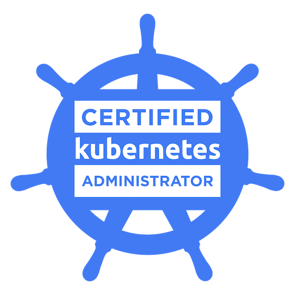

<!--  -->

Heya, I'm a DevOps Engineer at **Devsu**, with over four years of experience delivering reliable software solutions. I specialize in the automation, deployment, and continuous improvement of cloud-native infrastructure and development pipelines.

- 🏢 **Current Role**: DevOps Engineer at [Devsu](https://devsu.com/)
- 🔧 **Tech Focus**: CI/CD, Infrastructure as Code, Containers, Kubernetes, Cloud (Azure, AWS), Observability.
- 🌱 **Continuous Learning**: Passionate about Site Reliability Engineering and platform tooling.
- 💡 **Mindset**: Automation-first, security-conscious, and growth-oriented.

### Certificates and Badges 🏅

  
  
  
  

&nbsp;

  

